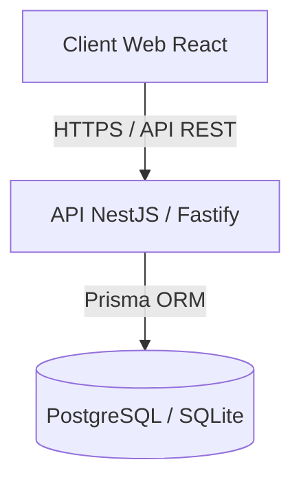

# FinTrack - Gestion de Budget & Analyse Comparative des Prix

**FinTrack** (anciennement GESFIN) est une application web moderne de suivi des dépenses familiales, d'analyse de l'inflation et de comparaison des prix au détail des articles de consommation courante. L'application intègre un lecteur intelligent de reçus d'achats réels par OCR (Reconnaissance Optique de Caractères).

---

## 🏗️ Architecture du Projet

Le projet est structuré en deux parties principales (monorepo) :



* **Frontend (`/frontend`)** : Application monopage (SPA) bâtie avec **React**, **Vite**, **TypeScript** et stylisée en **CSS pur (Vanilla CSS)** pour un design sombre premium, fluide et responsive.
* **Backend (`/backend`)** : API REST robuste construite avec **NestJS** (utilisant l'adaptateur haute performance **Fastify**), **Prisma ORM**, et la bibliothèque **Tesseract.js** pour l'extraction de texte OCR en français/anglais.

---

## ✨ Fonctionnalités Clés

1. **Tableau de Bord Premium** : Visualisation des indicateurs clés (dépenses mensuelles, annuelles, nombre de factures) et calcul automatique de l'**Indice d'Économie** personnalisé.
2. **Gestion des Factures & OCR Réel** : Numérisation directe de photos de reçus (Costco, No Frills, LCBO, etc.). Le parseur extrait les articles, prix unitaires, quantités (y compris le poids des articles pesés), taxes et remises. Un système d'apprentissage collaboratif mémorise vos corrections d'abréviations de produits et de noms de magasins.
3. **Comparateur de Prix Intelligent** : Analyse des prix pour un même produit d'un magasin à l'autre avec graphiques d'historique des prix, prix minimum/maximum/moyen, et suggestions d'optimisation (quel magasin est le moins cher).
4. **Enveloppes Budgétaires** : Définition de plafonds mensuels par catégorie de dépenses avec alertes de dépassement (vert 🟢, orange 🟠, rouge 🔴).
5. **Liste d'Achats Générée par IA** : Recommandation automatique de produits à acheter en fonction de vos habitudes et de la date du dernier achat.
6. **Sécurité & Isolation** : Authentification complète par Token JWT avec gestion de profil utilisateur et isolation stricte des données (chaque membre de la famille ne voit et ne compare que ses propres articles et factures).

---

## 🛠️ Démarrage Rapide (Développement Local)

Pour lancer l'application localement sur votre machine :

### 1. Démarrer le Backend (API)
```bash
cd backend
npm install --legacy-peer-deps
npx prisma generate
npx prisma db push
npx ts-node prisma/seed.ts # Injecte les données de démonstration (facultatif)
npm run start:dev
```
*L'API sera disponible sur : [http://localhost:3000](http://localhost:3000)*

### 2. Démarrer le Frontend (Client)
Dans un autre terminal :
```bash
cd frontend
npm install
npm run dev
```
*L'interface web sera disponible sur : [http://localhost:5173](http://localhost:5173)*

---

## 🚢 Déploiement en Production

Deux guides détaillés sont disponibles dans les dossiers respectifs :
* Pour déployer l'API (PM2, variables d'environnement) : Consulter [backend/README.md](file:///c:/Users/LENOVO/Documents/Projet%20GESFIN/backend/README.md)
* Pour compiler et servir le client (Nginx, HTTPS, SSL Certbot) : Consulter [frontend/README.md](file:///c:/Users/LENOVO/Documents/Projet%20GESFIN/frontend/README.md)

### Options de Déploiement :

#### Option A : Déploiement Hybride (Recommandé - PostgreSQL dans Docker, API sur l'Hôte)
Vous pouvez faire tourner uniquement la base de données PostgreSQL dans un conteneur Docker et exécuter l'API NestJS directement sur le serveur avec PM2 :
```bash
# 1. Démarrer uniquement la base de données PostgreSQL
docker compose up -d postgres

# 2. Configurer le backend (.env) pour se connecter à localhost:5432 et démarrer avec PM2
```

#### Option B : Déploiement Tout-en-un (Docker Compose)
Pour lancer à la fois le backend et la base de données PostgreSQL dans des conteneurs isolés :
```bash
docker compose up -d
```
Les données de la base de données PostgreSQL sont persistées de manière sécurisée via un volume Docker nommé `pgdata`.

---

## 📄 Licence

Ce projet est sous licence MIT.
